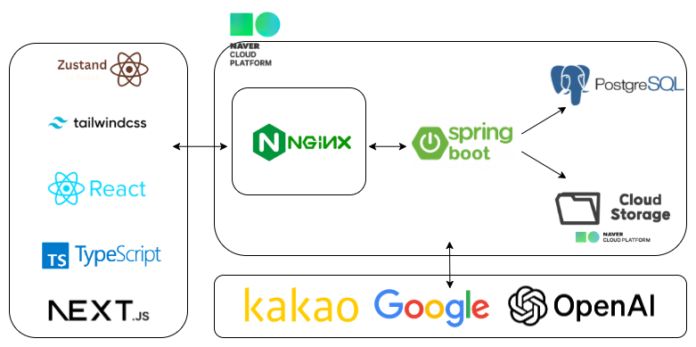

# be-paper-reader

# 📘 Paperdot
### 영어 원문과 번역문을 문장 단위로 정렬해주는 학습용 문서 리더 서비스

> 영어 PDF를 읽을 때  
> 원문과 번역을 자연스럽게 문장별로 연결해서 볼 수 없을까?  
> → 문서 파싱 + 문장 분리 + 번역 파이프라인으로 해결한 프로젝트

---

## 📌 프로젝트 개요

Paperdot은 영어 PDF 문서를 업로드하면  
원문을 문장 단위로 분리하고, 번역문과 정렬하여  
사용자가 **원문과 번역을 1:1로 대응해 읽을 수 있도록 돕는 서비스**입니다.

기존의 단순 번역기는 문서 전체 맥락을 유지하기 어렵고,  
PDF 특유의 복잡한 레이아웃 때문에 텍스트 추출이 불안정한 문제가 있습니다.

이를 해결하기 위해  
**PDF 파싱 + 문장 단위 분할 + 번역 정렬 + 사용자 문서 상태 저장** 구조로 서비스를 설계했습니다.

---

## 🧩 시스템 아키텍처

- 사용자가 영어 PDF 업로드
- 서버가 PDF 텍스트를 추출하고 문장 단위로 분리
- 번역 파이프라인이 각 문장을 번역
- 원문/번역문을 정렬하여 저장

---

## 🚀 개발 배경

- 영어 PDF는 문장별로 끊어 읽기 어려움
- 번역문과 원문이 자연스럽게 매칭되지 않음
- 논문, 다단 레이아웃 등은 일반적인 PDF 추출만으로 처리하기 어려움
- 학습 중 읽던 위치나 상태를 유지하기 어려움

➡️ 해결  
-> 문서 구조를 세분화해서  
**원문 추출 → 문장 분리 → 번역 → 상태 저장** 흐름으로 설계

---

## 💡 핵심 아이디어

- PDF 문서를 문장 단위(`doc_unit`)로 분리
- 각 문장에 대해 번역을 생성하고 정렬
- 사용자가 문서를 읽던 위치와 설정을 별도로 저장
- 문서 단위가 아니라 **학습 가능한 최소 단위** 중심으로 설계

---

## ⚙️ 주요 기능

### 1. PDF 문서 업로드 및 텍스트 추출
- PDF 문서를 업로드하여 원문 텍스트 추출
- 복잡한 영어 문서 레이아웃 처리 기반 마련

### 2. 문장 단위 문서 분할
- 추출한 텍스트를 문장 단위로 분리
- 학습과 번역 정렬에 적합한 구조로 저장

### 3. 번역 파이프라인
- 문장 단위 번역 수행
- 원문과 번역문을 1:1 구조로 정렬

<!--
### 4. 사용자 문서 상태 저장
- 마지막으로 읽은 위치 저장
- 사용자별 문서 열람 상태 관리
-->
### 4. 로그인 및 인증
- OAuth2 로그인 지원
- JWT 기반 인증 처리

---

🔥 트러블 슈팅

문서 전체를 한 번에 처리하는 구조는 번역 비용과 응답 지연이 큼 
-> 문장 단위 처리 중심으로 구조를 분리

일반 PDF 추출 방식만으로는 복잡한 영어 문서 레이아웃 대응이 어려움
-> 문서 구조에 맞춘 추출/후처리 방향으로 개선

<!--
사용자마다 읽던 위치와 설정이 달라 학습 경험이 끊김
-> 사용자 문서 상태 저장 구조 분리
-->

